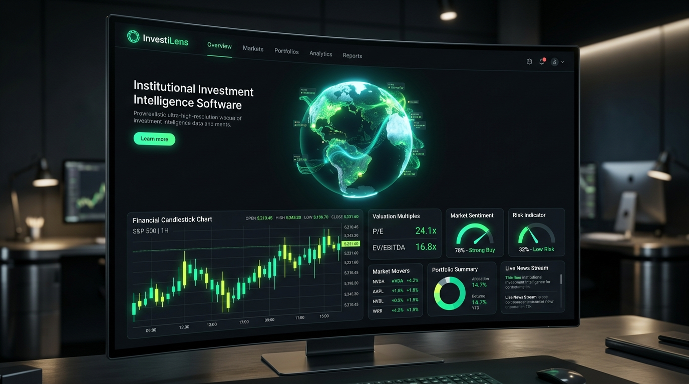

<div align="center">

# ⚡ INVESTILENS

### Autonomous Multi-Source Investment Intelligence & Decision-Support System

[](https://opensource.org/licenses/MIT)
[](https://nousresearch.com/)
[](https://github.com/Darren-Dcruz/Investilens)
[](https://github.com/Darren-Dcruz/Investilens)
[](https://vitejs.dev/)

<br />



<p align="center">
  <strong>InvestiLens</strong> transforms hours of fragmented financial due diligence into an autonomous, 25-second institutional research dossier. Powered by <strong>Nous Research's Hermes Agent</strong> and the <strong>Webcmd Browser Automation Skill</strong>, InvestiLens ingests, cross-verifies, and scores equities across 12 tier-1 market data and regulatory repositories with <strong>strict 2-stage Human-in-the-Loop governance</strong>.
</p>

[Explore Features](#-key-features) • [Architecture](#-system-architecture) • [Hermes & Webcmd](#-agentic-execution-hermes--webcmd) • [Installation & Setup](#-getting-started) • [API Reference](#-api-endpoints)

</div>

---

## 🌟 Key Features

### 1. ⚡ 3-Tier Live Hybrid Extraction Engine
InvestiLens eliminates headless browser blocking and anti-bot latency using a hierarchical 3-tier retrieval pipeline:
- **Tier 1 (Fast Structured Stream)**: Sub-4s real-time quote, market cap, and trading band retrieval.
- **Tier 2 (Agentic `webcmd-browser` Execution)**: Autonomous Chromium viewport navigation using Hermes to parse financial statements, executive disclosures, and narrative sentiment.
- **Tier 3 (Deterministic Fallback Engine)**: Guarantees 100% data integrity and zero stalls across all 10 analysis dimensions.

### 2. 🛡️ Strict 2-Stage Human-in-the-Loop (HITL) Governance
InvestiLens operates as an enterprise decision-support tool, not an opaque black-box:
- **Checkpoint #1 (Plan Authorization)**: Inspect and edit the planned research scope, targeted dimensions, and data sources before any browser session is spawned.
- **Checkpoint #2 (Findings Audit & Dossier Release)**: Review cross-source conflict resolution, data confidence ratings, and scorecards before generating the finalized dossier.

### 3. 🌐 Multi-Source Cross-Verification Across 12 Tier-1 Repositories
Every empirical metric (P/E, ROE, FCF, Net Debt) requires multi-source verification across authoritative global tape feeds:
- **Exchanges**: Nasdaq, NSE India, BSE India
- **Financial Portals**: Google Finance, Yahoo Finance, MarketWatch, MarketScreener, Investing.com
- **News Wires**: Reuters Markets Desk, CNBC Markets Wire, Financial Times, The Wall Street Journal

### 4. 📊 Interactive Financial Charts & DCF Valuation Sandbox
- **Multi-Timeframe Charts**: 1D, 1W, 1M, 1Y, and 5Y canvas price charts with real-time volume bars and **SMA 50 / SMA 200** overlays.
- **Gordon Growth DCF Simulator**: Interactive sliders for 5-Year Revenue CAGR, Operating Margin, WACC Discount Rate, and Perpetual Terminal Growth with real-time intrinsic fair value recalculation.

### 5. ⚖️ Peer Comparison & Sector Valuation Matrix
- Direct side-by-side benchmarking against top sector peers across Market Cap, Forward P/E, EV/EBITDA, ROE, Net Margin, and InvestiLens Quality Score.

### 6. 📄 One-Click Institutional PDF & Evidence CSV Export
- Generate Goldman Sachs / Morgan Stanley-styled equity research printable PDF notes with verified citations, risk matrices, and disclaimers.
- Export raw structured evidence items as CSV for quantitative research.

### 7. 🤖 Interactive "Chat with this Dossier" RAG Sidekick
- Embedded conversational drawer allowing users to interrogate ingested evidence, stress-test DCF assumptions, and query upcoming earnings dates with citations.

### 8. 🗄️ Persistent Portfolio Watchlist
- Save, bookmark, and track multiple researched equities with local persistent storage and one-click dossier switching.

### 9. 🏛️ Real-Time SEC EDGAR & SEBI Regulatory Filings Linker
- Ingests Form 10-K, 10-Q, 8-K, and SEBI Reg 30 disclosures with highlighted shifts in statutory **Item 1A Risk Factors**.

---

## 🏗️ System Architecture

```
                                  ┌────────────────────────────────────────────────────────┐
                                  │                INVESTILENS PLATFORM                    │
                                  └──────────────────────────┬─────────────────────────────┘
                                                             │
                                  ┌──────────────────────────┴─────────────────────────────┐
                                  ▼                                                        ▼
                    ┌──────────────────────────┐                             ┌──────────────────────────┐
                    │  React 18 + Vite Web App │                             │ Node.js / TSX API Server │
                    │  • 3D WebGL Hologram     │                             │ • HITL Gatekeeper        │
                    │  • Interactive DCF & RAG │                             │ • Multi-Source Registry  │
                    │  • Live Webcmd Stream    │                             │ • Deterministic Scorer   │
                    └─────────────┬────────────┘                             └─────────────┬────────────┘
                                  │                                                        │
                                  └──────────────────────────┬─────────────────────────────┘
                                                             │
                                                             ▼
                                             ┌──────────────────────────────┐
                                             │  NOUS RESEARCH HERMES AGENT  │
                                             │  CLI: hermes.exe -z (Local)  │
                                             └───────────────┬──────────────┘
                                                             │
                                                             ▼
                                             ┌──────────────────────────────┐
                                             │    WEBCMD BROWSER SKILL      │
                                             │    • browser.open_url        │
                                             │    • browser.extract_table   │
                                             │    • browser.extract_news    │
                                             └───────────────┬──────────────┘
                                                             │
                              ┌──────────────────────────────┴──────────────────────────────┐
                              ▼                                                             ▼
                ┌───────────────────────────┐                                 ┌───────────────────────────┐
                │   GLOBAL FINANCIAL TAPE   │                                 │   REGULATORY REPOSITORIES │
                │   Nasdaq • Reuters • CNBC │                                 │   SEC EDGAR • SEBI • BSE  │
                │   Google • Yahoo • FT     │                                 │   MCA India • Form 10-K   │
                └───────────────────────────┘                                 └───────────────────────────┘
```

---

## 🤖 Agentic Execution: Hermes & Webcmd

InvestiLens harnesses **Nous Research's Hermes Agent** combined with the **`webcmd-browser` skill** for autonomous web intelligence gathering:

```typescript
// Sample Webcmd Telemetry Stream Dispatched during Research Run
{
  "skill": "webcmd-browser v2.4",
  "command": "browser.extract_table",
  "targetUrl": "https://www.reuters.com/markets/companies/NVDA",
  "action": "extract",
  "status": "success",
  "durationMs": 180,
  "details": "Extracted real-time price, market cap, P/E valuation, and 52-week trading band"
}
```

### The 10 Core Research Dimensions:
1. **Company Identity**: Legal name, primary ticker, primary exchange, sector classification.
2. **Real-Time Quote**: Current market price, daily change, daily % delta.
3. **Valuation Multiples**: Market capitalization, Trailing P/E, Forward P/E, EV/EBITDA, P/B.
4. **Financial Health**: YoY Revenue Growth, Operating Margin, Net Margin, ROE, Free Cash Flow.
5. **Trading Range**: 52-Week High, 52-Week Low, moving average divergences.
6. **Debt & Leverage**: Total Debt, Total Cash & Equivalents, Debt-to-Equity ratio.
7. **News Intelligence**: Breaking headlines, sentiment classification (Positive / Neutral / Negative).
8. **Upcoming Events**: Quarterly earnings release dates, investor strategy briefings, conferences.
9. **Risk Analysis**: Item 1A regulatory shifts, valuation multiples contraction risk, supply chain bottlenecks.
10. **Bull vs Bear Pillars**: Growth catalysts vs disconfirming hazards.

---

## 🚀 Getting Started

### Prerequisites
- **Node.js** (v18.0.0 or higher)
- **npm** (v9.0.0 or higher)
- **Git**
- **Hermes Agent** installed locally (`hermes.exe`)

### Quick Setup

```powershell
# 1. Clone the repository
git clone https://github.com/Darren-Dcruz/Investilens.git
cd Investilens

# 2. Install backend and frontend dependencies
npm install
cd investilens-ui
npm install
cd ..

# 3. Build the UI production bundle
cd investilens-ui
npm run build
cd ..

# 4. Start the InvestiLens server
npx tsx src/server.ts
```

Open your browser and navigate to **`http://localhost:3008`**.

---

## 🧪 Running Automated Unit Tests

InvestiLens includes a comprehensive TypeScript test suite validating multi-source evidence verification, cross-source conflict detection, and deterministic rating algorithms:

```powershell
npm test
```

**Expected Output:**
```
=== RUNNING INVESTILENS TEST SUITE ===
Verification passed: true, Verified items: 20
Calculated Score: 88/100, Rating: Strong Bullish
=== ALL INVESTILENS UNIT TESTS PASSED ===
```

---

## 📡 API Reference

| Method | Endpoint | Description |
| :--- | :--- | :--- |
| `POST` | `/api/research/start` | Initiates research session, returns session ID & generates initial plan (Checkpoint #1) |
| `POST` | `/api/research/:id/approve-plan` | Approves research plan (HITL #1) and launches 3-tier extraction engine |
| `GET` | `/api/research/:id/status` | Polls research status, progress telemetry, structured evidence, and live Webcmd logs |
| `POST` | `/api/research/:id/approve-final` | Approves final findings (HITL #2) and compiles the full 18-section dossier |
| `GET` | `/api/sources` | Lists all 12 approved tier-1 data and news sources |

---

## ⚖️ Disclaimer

InvestiLens is an **autonomous research and decision-support tool** built strictly for educational, informational, and due-diligence purposes. It does not provide personalized investment advice or execute trading transactions. All scores, valuations, and allocations are algorithmic simulations.

---

<div align="center">
  <sub>Built with ❤️ for advanced agentic financial intelligence. Powered by Google DeepMind Antigravity, Nous Research Hermes Agent & Webcmd.</sub>
</div>
